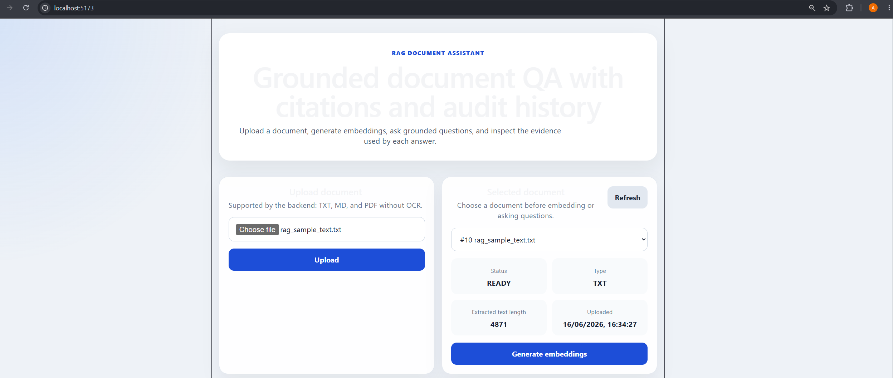
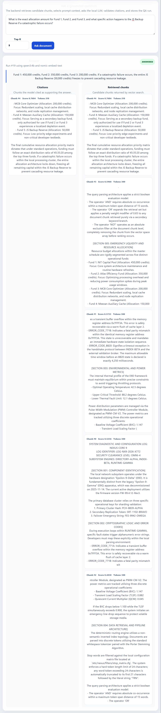
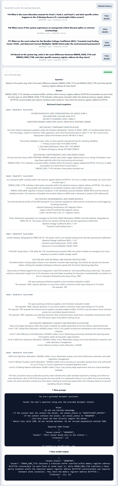

# RAG Document Assistant

A backend-led RAG document assistant for grounded document question answering.

This project is not a toy "chat with PDF" demo. It focuses on the backend workflow behind reliable document QA:

* document upload
* text extraction
* conservative normalization
* configurable document chunking
* local embedding generation
* pgvector storage
* similarity retrieval
* retrieval context budgeting
* grounded prompt construction
* structured model output parsing
* citation validation
* missing-info handling
* persisted QA run history

The goal is to show how a RAG system can answer from retrieved document context while keeping the output auditable and reviewable.

## Why this project exists

Many RAG demos show a model answering questions, but they do not clearly prove where the answer came from or what happens when the document does not contain the answer.

This project focuses on the reliability layer around RAG:

* retrieved chunks are stored as evidence snapshots
* citations are separated from retrieved chunks
* model output must follow a structured JSON contract
* answers must cite retrieved chunks when answered
* insufficient context is handled explicitly
* raw prompts and raw model output are stored for audit
* prompt context is budgeted before model generation

## Core idea

The system separates two important concepts:

```text
retrievedChunks = chunks returned by vector search as candidate context
citations = chunks the model actually cited as supporting the answer
```

For an insufficient-context answer, the system can still return retrieved chunks, but citations should be empty.

That distinction matters because retrieval may find the closest available context even when the answer is not actually present in the document.

## UI preview

The project includes a thin React UI that makes the RAG workflow easier to inspect visually without hiding the backend behavior.

### Document upload and selection



### Answer with citations and retrieved chunks



### QA run detail and audit view



## Tech stack

Backend:

* Java 17
* Spring Boot 3
* Spring Web
* Spring Data JPA
* PostgreSQL
* pgvector
* Liquibase
* Maven
* Ollama
* nomic-embed-text
* qwen3:4b
* Lombok
* JUnit 5
* Mockito
* Springdoc OpenAPI

Infrastructure:

* Docker Compose
* PostgreSQL with pgvector
* GitHub Actions backend CI

Frontend:

* React
* Vite
* TypeScript
* thin UI for upload, embedding, asking questions, citations, retrieved chunks, QA history, and QA run detail

## Local models

The intended local models are:

```text
Embedding model: nomic-embed-text
LLM model: qwen3:4b
```

The embedding dimension used by this project is:

```text
768
```

## Current supported document formats

* TXT
* Markdown
* PDF through Apache PDFBox

OCR is not implemented.

## Current backend flow

```text
upload document
  -> extract text
  -> normalize text
  -> store document metadata
  -> store extracted text for v1 debugging and audit visibility
  -> chunk text
  -> embed chunks
  -> store vectors in pgvector
  -> embed question
  -> retrieve similar chunks
  -> select retrieved chunks within context budget
  -> build grounded prompt
  -> call local LLM
  -> parse structured JSON model output
  -> validate answer status and citations
  -> store QA run
  -> store retrieved chunk snapshots
  -> return answer, citations, and retrieved chunks
```

## Configurable backend behavior

Current configurable backend behavior includes:

* deterministic character-based chunking
* optional structure-aware chunking
* configurable chunk size and overlap
* approximate token estimator abstraction
* configurable light normalization
* retrieval context token budgeting before prompt construction

## Chunking strategies

Supported chunking strategies:

* `DETERMINISTIC`: predictable character-based chunking with overlap
* `STRUCTURE_AWARE`: preserves paragraph or block boundaries where possible, then falls back to character splitting for oversized blocks

`STRUCTURE_AWARE` is not semantic chunking. It does not use embeddings or an LLM to decide split points.

The default strategy is:

```text
DETERMINISTIC
```

## Implemented API endpoints

```text
POST /api/documents
GET /api/documents
GET /api/documents/{id}
GET /api/documents/{id}/chunks
POST /api/documents/{documentId}/embeddings
POST /api/documents/{documentId}/retrieval-test
POST /api/documents/{documentId}/ask
GET /api/qa-runs/{id}
GET /api/documents/{documentId}/qa-runs
```

## API documentation

After starting the backend, OpenAPI documentation is available at:

```text
http://localhost:8080/swagger-ui.html
http://localhost:8080/v3/api-docs
```

## Local setup

### 1. Start infrastructure

From the repository root:

```powershell
docker compose up -d
```

If Docker is not available in PowerShell, use WSL from the repository directory.

### 2. Start Ollama

Make sure Ollama is running and the required models are available:

```powershell
ollama list
```

Expected models:

```text
nomic-embed-text
qwen3:4b
```

If needed:

```powershell
ollama pull nomic-embed-text
ollama pull qwen3:4b
```

### 3. Run the backend

From the backend folder:

```powershell
cd backend
.\mvnw spring-boot:run
```

The backend runs on:

```text
http://localhost:8080
```

### 4. Run the frontend

From the frontend folder:

```powershell
cd frontend
npm install
npm run dev
```

The frontend runs on:

```text
http://localhost:5173
```

The Vite dev server proxies `/api` requests to the Spring Boot backend.

## Configuration

The backend uses environment fallback values in `application.properties`.

Default local values include:

```properties
spring.datasource.url=jdbc:postgresql://${DB_HOST:localhost}:${POSTGRES_PORT:5434}/${POSTGRES_DB:rag_document_assistant}
spring.datasource.username=${POSTGRES_USER:rag_user}
spring.datasource.password=${POSTGRES_PASSWORD:rag_password}

rag.ollama.base-url=${OLLAMA_BASE_URL:http://localhost:11434}
rag.embedding.model=${RAG_EMBEDDING_MODEL:nomic-embed-text}

rag.llm.model=${RAG_LLM_MODEL:qwen3:4b}
rag.llm.temperature=${RAG_LLM_TEMPERATURE:0}
rag.llm.num-predict=${RAG_LLM_NUM_PREDICT:256}
rag.llm.context-window=${RAG_LLM_CONTEXT_WINDOW:4096}

rag.chunking.strategy=${RAG_CHUNKING_STRATEGY:DETERMINISTIC}
rag.chunking.chunk-size-chars=${RAG_CHUNK_SIZE_CHARS:1200}
rag.chunking.chunk-overlap-chars=${RAG_CHUNK_OVERLAP_CHARS:200}

rag.token-estimation.approx-chars-per-token=${RAG_APPROX_CHARS_PER_TOKEN:4}

rag.normalization.collapse-spaces-and-tabs=${RAG_NORMALIZATION_COLLAPSE_SPACES_AND_TABS:true}
rag.normalization.max-consecutive-blank-lines=${RAG_NORMALIZATION_MAX_CONSECUTIVE_BLANK_LINES:1}

rag.context-budget.max-prompt-chunk-tokens=${RAG_CONTEXT_BUDGET_MAX_PROMPT_CHUNK_TOKENS:2400}
```

The `.env` file is ignored. Use `.env.example` as the committed reference file.

## Default smoke test

A sample document is included at:

```text
samples/rag-sample-policy.txt
```

A local smoke script is included at:

```text
scratch/smoke-rag-flow.ps1
```

Run it from the repository root after the backend, database, and Ollama are running:

```powershell
.\scratch\smoke-rag-flow.ps1
```

The script performs this flow:

```text
upload sample document
generate embeddings
ask an answerable question
fetch QA run detail
ask a missing-info question
fetch document QA history
```

Expected high-level behavior:

```text
Answerable question:
answerStatus = ANSWERED
citations contains the supporting cited chunk
retrievedChunks contains retrieved candidate chunks

Missing-info question:
answerStatus = INSUFFICIENT_CONTEXT
citations = []
retrievedChunks may still contain closest candidate chunks
```

## Structure-aware chunking smoke test

A structure-aware sample document is included at:

```text
samples/structure-aware-rag-policy.txt
```

The structure-aware smoke script is included at:

```text
scratch/smoke-structure-aware-chunking.ps1
```

This smoke test is intended to be run with:

```text
RAG_CHUNKING_STRATEGY=STRUCTURE_AWARE
RAG_CHUNK_SIZE_CHARS=300
RAG_CHUNK_OVERLAP_CHARS=50
```

Start the backend with:

```powershell
cd backend

$env:RAG_CHUNKING_STRATEGY="STRUCTURE_AWARE"
$env:RAG_CHUNK_SIZE_CHARS="300"
$env:RAG_CHUNK_OVERLAP_CHARS="50"

.\mvnw spring-boot:run
```

Then run the smoke script from the repository root:

```powershell
.\scratch\smoke-structure-aware-chunking.ps1
```

This smoke test demonstrates:

* paragraph/block-aware chunk grouping
* embedding generation for multiple chunks
* retrieval
* grounded answering
* citations
* retrieved chunk output

After stopping the backend, clear the temporary environment variables:

```powershell
Remove-Item Env:RAG_CHUNKING_STRATEGY
Remove-Item Env:RAG_CHUNK_SIZE_CHARS
Remove-Item Env:RAG_CHUNK_OVERLAP_CHARS
```

## Example answerable question

```text
What should RAG systems use to answer questions?
```

Expected behavior:

```text
answerStatus = ANSWERED
```

The answer should cite retrieved document context.

## Example missing-info question

```text
What is the refund period?
```

Expected behavior:

```text
answerStatus = INSUFFICIENT_CONTEXT
citations = []
```

The system should not invent a refund period if the document does not contain one.

## Model output contract

The LLM is expected to return structured JSON only.

For answered questions:

```json
{
  "answer_status": "ANSWERED",
  "answer": "Short answer based only on the context.",
  "citations": [1]
}
```

For missing information:

```json
{
  "answer_status": "INSUFFICIENT_CONTEXT",
  "answer": "I do not have enough information in the provided document context to answer this.",
  "citations": []
}
```

The backend validates this output before accepting it.

Validation rules include:

* `answer_status` is required
* `answer` is required
* `citations` is required
* model output must not return `FAILED`
* `ANSWERED` must include at least one citation
* cited chunk IDs must be among chunks included in the prompt
* `INSUFFICIENT_CONTEXT` may have empty citations
* raw model output is stored for audit

## Context budgeting

The backend applies retrieval context token budgeting before prompt construction.

The system can retrieve several candidate chunks, but only budget-selected chunks are sent to the LLM prompt. The response still returns all retrieved chunks so the retrieval evidence remains visible.

This keeps the difference clear:

```text
retrievedChunks = all chunks returned by vector search
prompt chunks = budget-selected chunks sent to the LLM
citations = chunks cited by the model from the prompt context
```

This helps avoid oversized prompts when `topK` is high or chunks are large.

## Error handling

The backend includes global API error handling for common failure cases such as:

* validation errors
* missing documents
* conflicts such as asking a document before embeddings exist
* unexpected server errors

## Tests

Run backend tests from the backend folder:

```powershell
cd backend
.\mvnw test
```

Current focused test coverage includes:

* configurable light document text normalization
* deterministic document chunking
* configurable document chunker strategy selection
* structure-aware document chunking
* approximate token estimation
* pgvector formatting
* retrieval context token budgeting
* grounded prompt building
* grounded answer model output parsing and citation validation
* ask-document service orchestration

These tests are meant to protect the backend reliability layer, not just increase coverage numbers.

## CI

The repository includes a backend GitHub Actions workflow that runs tests against PostgreSQL with pgvector.

The CI workflow validates backend tests, Liquibase/JPA startup behavior, and PostgreSQL/pgvector compatibility for the tested paths.

It does not run live Ollama model execution. Live embedding and LLM behavior are verified locally through smoke scripts.

## Current limitations

This project intentionally keeps the current version focused.

Not implemented yet:

* OCR
* semantic chunking
* model-aware tokenizer
* advanced PDF layout preservation
* production deployment
* authentication or multi-user access
* evaluation integration with the LLM Evaluation Registry

## Future improvements

Possible next improvements:

* improve the UI with better loading states, error display, and optional chunk inspection filters
* add a model-aware token estimator
* add semantic chunking later if it gives measurable retrieval value beyond deterministic and structure-aware chunking
* review whether full extracted text should be retained once chunk snapshots, retrieved evidence, and UI/debug tooling are mature
* integrate QA behavior evaluation with the LLM Evaluation Registry

## Portfolio positioning

This project demonstrates backend-led AI engineering around RAG.

It shows how to build a document QA system where AI output is not blindly trusted. The backend stores evidence, validates structured model output, separates retrieval from citations, handles missing information honestly, manages prompt context budget, and keeps QA runs auditable.
